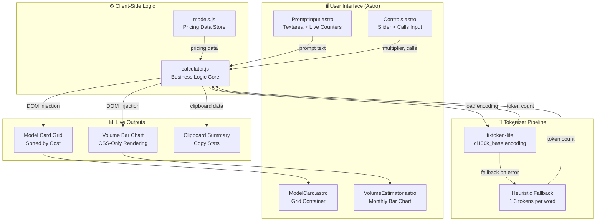

# ⚡ TokenCalc AI — Prompt Token & Cost Calculator

<div align="center">

[](https://astro.build/)
[](https://tailwindcss.com/)
[](https://developer.mozilla.org/en-US/docs/Web/JavaScript)
[](https://esm.sh/tiktoken-lite)
[](./LICENSE)

**TokenCalc AI** is a production-ready, fully client-side prompt token & cost calculator — supporting **17 AI models** across OpenAI, Anthropic, Google Gemini, xAI Grok, DeepSeek, and Mistral with accurate token counting, real-time projections, and zero backend dependencies.

[**→ View on GitHub**](https://github.com/ThatKJ/tokencalc)

</div>

---

## ⚡ Overview

TokenCalc AI resolves the pain point of estimating AI API costs before committing to a model. Paste your prompt, adjust your call volume, and instantly compare token counts and projected costs across all major frontier models — sorted cheapest-first, with the best value automatically highlighted.

- **🔢 Accurate Token Counting** — `tiktoken-lite` (cl100k_base / GPT-4 encoding) loaded over `esm.sh` with a 1.3 tokens/word heuristic fallback.
- **💰 17 AI Models** — OpenAI, Anthropic Claude, Google Gemini, xAI Grok, DeepSeek, and Mistral with June 2026 pricing.
- **🌓 Native Dark Mode** — instant theme toggling with zero flash-of-wrong-theme (FOUC), persisting via `localStorage`.
- **📊 Live Model Grid** — sorted cheapest-first, cheapest model auto-highlighted in teal.
- **📈 Monthly Volume Estimator** — horizontal bar chart across 1 → 1M daily calls with full light/dark responsiveness.
- **⚡ Real-Time Updates** — debounced 150ms DOM updates, zero page reloads.
- **📋 Copy Stats** — one-click clipboard summary of all token and cost data.
- **📱 Fully Responsive** — 1 → 2 → 3 column adaptive grid with mobile-first layout.

---

## 🏗️ System Architecture



---

## 💰 Models & Pricing (June 2026)

| Provider | Model | Input $/1M | Output $/1M |
|---|---|---|---|
| **OpenAI** | GPT-5.5 | $5.00 | $30.00 |
| **OpenAI** | GPT-5.4 | $2.50 | $15.00 |
| **OpenAI** | GPT-5.4 Mini | $0.75 | $4.50 |
| **OpenAI** | GPT-5.4 Nano | $0.20 | $1.25 |
| **Anthropic** | Claude Opus 4.7 | $5.00 | $25.00 |
| **Anthropic** | Claude Sonnet 4.6 | $3.00 | $15.00 |
| **Anthropic** | Claude Haiku 4.5 | $1.00 | $5.00 |
| **Google** | Gemini 3.1 Pro | $2.00 | $12.00 |
| **Google** | Gemini 3.5 Flash | $1.50 | $9.00 |
| **Google** | Gemini 3 Flash | $0.50 | $3.00 |
| **Google** | Gemini 3.1 Flash-Lite | $0.25 | $1.50 |
| **xAI** | Grok 4.2 | $1.25 | $5.00 |
| **xAI** | Grok 4.1 Mini | $0.40 | $2.00 |
| **DeepSeek** | DeepSeek V3.2 | $0.80 | $2.80 |
| **DeepSeek** | DeepSeek R1 | $1.20 | $4.50 |
| **Mistral** | Mistral Large 2 | $2.00 | $6.00 |
| **Mistral** | Mistral Small 3 | $0.40 | $1.60 |

---

## 📂 Project Structure

```
ai-prompt-cost-calculator/
├── public/
│   ├── favicon.svg               # Brand favicon
│   └── logo.png                  # TokenCalc logo
├── src/
│   ├── components/
│   │   ├── PromptInput.astro     # Textarea + token / char counters
│   │   ├── ModelCard.astro       # JS-rendered model card grid container
│   │   ├── Controls.astro        # Multiplier slider + daily calls input
│   │   └── VolumeEstimator.astro # Monthly volume bar chart container
│   ├── layouts/
│   │   └── MainLayout.astro      # Root HTML shell + SEO meta + Open Graph
│   ├── pages/
│   │   └── index.astro           # Single-page entry point
│   ├── scripts/
│   │   └── calculator.js         # All business logic + DOM rendering
│   ├── data/
│   │   └── models.js             # Model pricing data store
│   └── styles/
│       └── global.css            # Design tokens + global styles
├── astro.config.mjs              # Astro + Tailwind v4 Vite plugin config
└── tsconfig.json                 # TypeScript config with path aliases
```

---

## 🎨 Design System

TokenCalc uses a hand-crafted **Technical Minimalist** palette driven entirely by CSS custom properties, fully supporting light (default) and dark mode:

| Token | Light Value | Dark Value | Usage |
|---|---|---|---|
| `--primary` | `#00687a` | `#2ea4b8` | Teal accent, CTAs, highlights |
| `--s0` | `#f5fafc` | `#0d1117` | Page background |
| `--s1` | `#ffffff` | `#161b22` | Card / panel surfaces |
| `--s2` | `#eff4f7` | `#1c2128` | Section fills, input backgrounds |
| `--s3` | `#e3e9eb` | `#21262d` | Deeper sections, dividers |
| `--s4` | `#dee3e6` | `#30363d` | Default borders |
| `--s5` | `#bcc9cd` | `#484f58` | Muted borders |
| `--f-headline`| `Hanken Grotesk` | `Hanken Grotesk` | Headings and brand text |
| `--f-body` | `Geist` | `Geist` | Body and UI copy |
| `--f-mono` | `JetBrains Mono` | `JetBrains Mono` | Labels, numbers, badges |

---

## ☁️ Deploy to Cloudflare Workers

This site ships as static assets on **Cloudflare Workers** (not Pages).

```bash
npm install
npx wrangler login          # one-time browser auth
npm run deploy              # build dist/ + upload
```

**API token (CI / non-interactive):** create a token with *Workers Scripts* + *Account Settings* read, then:

```bash
export CLOUDFLARE_API_TOKEN="your-token"
export CLOUDFLARE_ACCOUNT_ID="your-account-id"
npm run deploy
```

After deploy, Wrangler prints a `*.workers.dev` URL. To use **tokencalc.app**, add a custom domain in the [Cloudflare dashboard](https://dash.cloudflare.com/) → Workers & Pages → `tokencalc` → Settings → Domains & Routes.

Local preview on the Workers runtime: `npm run preview:cf`

---

## 🚀 Quality

- **Zero backend** — fully static, deployable to any CDN or Cloudflare Workers static assets.
- **Graceful degradation** — tiktoken-lite failure triggers a seamless 1.3 tokens/word fallback.
- **Debounced rendering** — 150ms input debounce prevents layout thrash on large pastes.
- **Accessible** — semantic HTML, ARIA labels, keyboard-navigable controls throughout.

---

*Pricing last updated **June 2026**. For estimation purposes only — actual costs may vary.*
